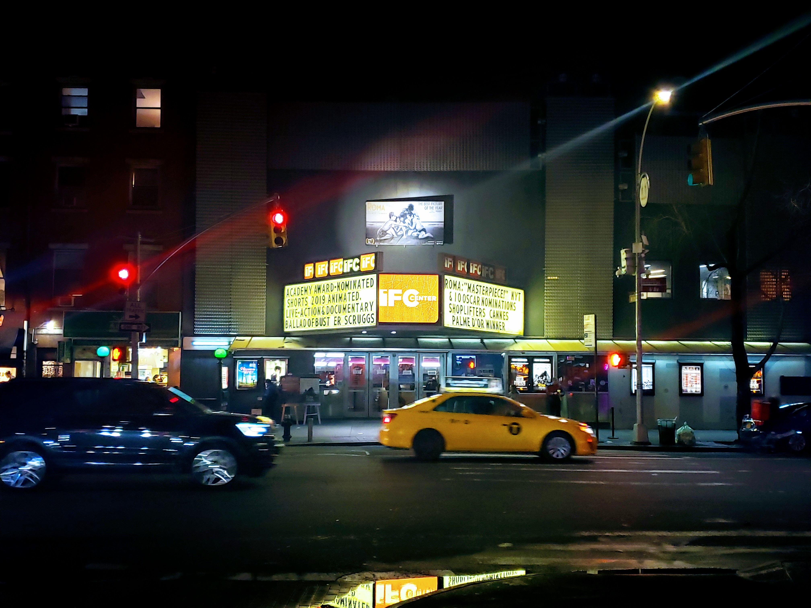

# pixelsort
[OSX release](https://github.com/quasi-coherent/pixelsort/releases)

## usage
Full list of options:

``` bash
Usage: pixelsort --file ARG [-r] [-g] [-b] [-a] [-A] [-L] [-H]

Available options:
  -h,--help                Show this help text
  --file ARG               Image to sort
  -r                       Sort by red
  -g                       Sort by green
  -b                       Sort by blue
  -a                       Sort by alpha
  -A                       Sort by average of pixel values
  -L                       Sort by luminance
  -H                       Sort by hue
```

With `pixelsort` somewhere on your path,

``` bash
pixelsort --file /path/to/image.jpg -r -g -b
```

will sort the rows of pixels of `image.jpg` by red, green, blue, respectively, for example.

## examples



